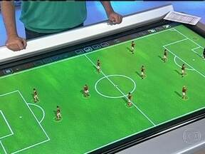

# Projeto de CG - Cena

Vamos utilizar o renderizador implementado nas tarefas anteriores para renderizar uma cena.

Sugerimos que comecem o projeto analisando o arquivo `atividade.py`. Ele tem um exemplo básico de cena utilizando texturas, geometria importada e outros recursos do renderizador. Este é apenas um exemplo simples mostrando recursos que você pode utilizar para preparar a cena. Esperamos que o projeto entregue seja melhor em composição e qualidade gráfica.

Também sugerimos que leiam inteiramente este documento antes de iniciar o projeto, a sua proposta de cena pode mudar caso decidam implementar um item opcional (mas vocês também podem decidir isso depois).

## Formato de entrega

Vocês devem entregar neste Projeto:

- Descrição de cena: descrição de cena que implementaram (no final deste documento).
- Código: código Python utilizado para implementar a cena. O ponto de entrada da cena deve ser `atividade.py`
- Assets: todo shader, modelo, textura e outros utilizado para implementar a cena. Devem estar na pasta `assets`
- Lista de Assets: lista de todos os assets baixados da internet (no final deste documento).
- Cena final renderizada: podendo ser tanto uma imagem quanto um vídeo.

## Tarefas

- Descrevam a cena que desejam implementar. 
  - Encontrem imagens e vídeos de referência.
  - Indiquem quais objetos estarão na cena.
  - Indiquem o resultado visual esperado. Existe algum conceito ou sentimento que querem passar com essa imagem/vídeo?
  - Sejam criativos! Vocês podem querer recriar alguma cena fictícia ou lugar do mundo real, fazer uma composição surreal, testar algum efeito ou fazer uma simulação de algum fenômeno físico.
- Copiem arquivos implementados anteriormente;
  - Copiem toda a pasta `src` da última atividade de CG.
  - Copiem os shaders finais `vertex.vs` e `05-fragment.fs` para a pasta `assets`. Eles podem ser utilizados como base para implementar a renderização da cena de vocês, que pode utilizar diferentes shaders para cada objeto.
- Criem a geometria de cena.
  - Para isso, você pode utilizar tanto as primitivas que temos definidas (cubo, esfera, triângulo), quanto criar uma cena externamente e importar.
  - A cena pode utilizar assets encontrados na internet, desde que indicadas as fontes.
  - Para criar uma cena externamente, você pode utilizar programas de edição como o Blender, tanto utilizando modelos prontos quanto modelando eles. O programa deve suportar salvar o arquivo em GLTF (`.glb`), ou você pode convertê-lo de alguma forma. Existe uma função `urenderer.geometry.mesh.load_glb` que carrega um arquivo GLTF para o nosso grafo de cena.
- Determinem materiais para a cena;
  - Vocês podem encontrar materiais para utilizar online (ex. https://ambientcg.com/list?type=atlas,material,decal)
  - Vocês também podem criar materiais.
- (Opcional): animem a cena.
  - O arquivo de exemplo contém formas de animar objetos, como alterar a posição, rotação e escala utilizando uma função do tempo, ou simulando numericamente uma equação diferencial.
- (Opcional): realizem alterações na renderização para alcançar algum resultado desejado:
  - Melhorias no sistema de sombreamento: vocês podem implementar alterações no sombreamento, como [IBL](https://learnopengl.com/PBR/IBL/Diffuse-irradiance) (_image base lighting_) para renderizar melhor materiais metálicos, adicionar [sombras](https://learnopengl.com/Advanced-Lighting/Shadows/Shadow-Mapping), utilizar uma refletância especular melhor como a [GGX](https://learnopengl.com/PBR/Lighting) ou implementar [normal mapping](https://learnopengl.com/Advanced-Lighting/Normal-Mapping) para aparência mais realista de materiais tridimensionais.
  - [Pós-processamento](https://learnopengl.com/Advanced-OpenGL/Framebuffers): efeitos implementados na parte de Processamento de Imagem podem ser bons pós-processamentos para CG, efeitos aplicados após renderizar um frame.
  - Modelos de sombreamento não realista: trabalhamos na disciplina principalmente sombreamento realista com PBR, mas existem muitas formas de realizar sombreamentos não realistas e estilizados. A complexidade deles varia, e podem trazer visuais muito interessantes.

## Avaliação

O projeto será avaliado segundo:

- Complexidade da composição: a geometria, seu posicionamento (layout) e texturas utilizadas.
- Qualidade gráfica: como a composição foi renderizada, se apresenta problemas de iluminação ou artefatos.
- Estética: como a composição e renderização se relacionam com a proposta apresentada.
- Técnica: o código implementado, como está organizado e quais conceitos aplica.

---

# Entregas Textuais

## Descrição da cena

### **Conceito e Proposta**
A cena implementada recria uma simulação de esquema tático (4-3-3) de uma equip de futebol, para nosso projeto escolhemos o vitória, onde haveria a simulação de um estádio e a equipe exposta no campo, além do simbolo do clube exposto atrá do campo. A inspiração para o projeto foi um elemento utilizado no Globo Esporte, programa esportivo da Rede Globo, onde eles tinham um quadro do programa em que faziam as simulações das equipes no campo em um equipamento em que chamava de "mesa tática", na qual havia simulações 3d dos jogadores no campo, em miniatura, encima dessa mesa.

   

### **Elementos da Cena e Geometria**
1. **Gramado com Marcações de Campo:**
   * Utilização de uma malha 3D plana dimensionada em `20.0 x 35.0` unidades.
   * Aplicação de textura PBR de relva (*Grass001*) combinada com marcações brancas oficiais desenhadas via OpenCV (círculo central, grandes e pequenas áreas, marcações de escanteio).

2. **Jogadores de Futebol (Time do Vitória):**
   * 11 modelos 3D *Low Poly* carregados via arquivo GLB (`low_poly_soccer_player.glb`).
   * Mapeamento de textura via Atlas para aplicar uniformes e detalhes dos atletas.
   * Posicionamento estratégico formando a tática 4-3-3 (Goleiro, 4 Defensores, 3 Meias e 3 Atacantes).

3. **Arquibancadas do Estádio:**
   * Três estruturas modulares de arquibancada carregadas via GLB (`estrutura_arquibancada_02.glb`).
   * Dispostas nas duas laterais e no fundo do campo, emoldurando a cena no formato característico de um estádio de futebol.
   * Recebem um material escuro de concreto para garantir contraste e destacar a ação no relvado.

4. **Bandeira de Fundo:**
   * Painel proporcional no fundo da cena aplicando a textura da bandeira do Vitória.

---

### **Iluminação, Sombreamento e Materiais (PBR)**
* **Materiais PBR:** Configuração de albedo, rugosidade (*roughness*) e metálico (*metallic*) para destacar o brilho nos uniformes e refletores sem deixar a imagem lavada.
* **Luzes de Refletor:** Adição de refletores pontuais (*Point Lights*) de alta intensidade posicionados no topo do estádio com tons levemente aquecidos e frios para simular torres de iluminação reais.
---

### **Animação**
* **Atletas:** Aplicação de callbacks que alteram a rotação e a altura dos nós dos jogadores em função do tempo (`math.sin` e `math.cos`), simulando passadas de corrida e balanço lateral.
* **Câmera de Sobrevoo (Camera Flyover):** Animação da cena raiz (`cena_root`) que rotaciona a perspectiva suavemente em torno do estádio, cobrindo a visão panorâmica do campo e das arquibancadas ao longo da renderização do vídeo.

---

## Assets utilizados

- **Low Poly Soccer Player**: `Creative Commons Attribution (CC-BY)` (`https://sketchfab.com/`)
- **ESTRUTURA ARQUIBANCADA 02**: `CC-BY-4.0` por RN Estrutural (`https://sketchfab.com/3d-models/estrutura-arquibancada-02-73df0751bba14ddbb55c024ad80e30a1`)
- **Grass001_1K-PNG (Textura de Grama)**: `CC0 (Domínio Público)` por AmbientCG (`https://ambientcg.com/view?id=Grass001`)
